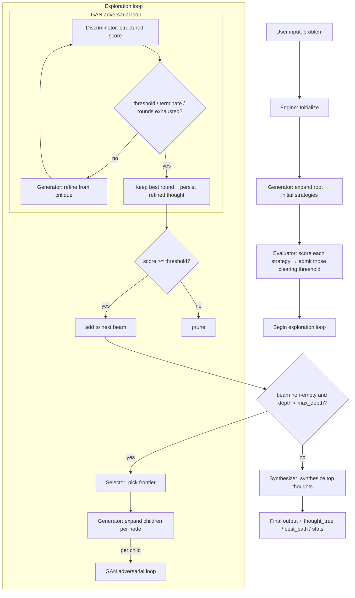

# Dialectica 

[](https://pypi.org/project/dialectica/) [](https://twitter.com/FradSer) [](https://www.python.org/downloads/) [](https://google.github.io/adk-docs/) []()

**English** | [简体中文](README.zh-CN.md)

**Dialectica** is a reasoning-engine toolbox on Google ADK. It was built and measured the hard way — running the engines against well-controlled baselines and keeping only what the data justifies. The honest hierarchy:

- **Agentic engine** (`create_agentic_engine`) — the one engine that genuinely lets a model do what a single call *cannot*: a tool-using loop (act → observe → iterate). It wins by adding **capability**, not quality — measured **8/8 vs a single call's 0/8** for a *small* model on tasks that require gathering information through tools.
- **Execution-guided repair** (`create_repair_engine`) — generate → run a verifier → repair against the failure → retry. On verifiable tasks it reaches best-of-N reliability at a **fraction of the cost** (it short-circuits on success).
- **Dialectic** (`create_dialectic_engine`) — *thesis → antithesis → synthesis*: an **auditable**, criteria-steered reasoning trace (transparency, not better answers).
- **Tree-of-Thoughts + GAN** (`create_engine`) — the prior-generation pluggable pipeline, kept as a baseline. Measured **dominated** at matched compute (loses to both best-of-N and flat self-refine — see [Evaluation](#evaluation) finding #3); kept for study and back-compat, not recommended for quality.

> **Honest scope (measured, no preset conclusion — see [Evaluation](#evaluation)).** The hard finding first: on **self-contained** tasks, *no* pure-LLM scaffold (ToT, dialectic) beats a prompt-matched single call on result quality, at every model size tested (dialectic **0-3-2** vs a prompt-matched call; ToT+GAN **0-4-1** vs a single call, and **dominated** by flat best-of-N and self-refine at matched compute) — they rearrange the model's own thinking without adding information, and the tree structure degrades the refinement a flat loop already delivers. Even on **Game-of-24** — ToT's canonical search benchmark — the task is saturated for every cloud-accessible model (single call 5/5 on the hardest puzzles across qwen-flash / gemini-lite / doubao-lite / glm-5.2), so ToT's recovery window is empty. An engine wins only by adding what a single forward pass lacks: **acting on the world** (agentic: small model **8/8 vs 0/8**) or **ground-truth verification** (repair: best-of-N reliability at **~1/3 the calls**). Reproduce with `uv run python -m evals.agentic_eval` and `uv run python -m evals.repair_ablation`.

Inspired by [karpathy/autoresearch](https://github.com/karpathy/autoresearch) and Claude Code's composable workflows.

## Install

Use it as a library in your own project:

```bash
uv add dialectica
# or: pip install dialectica
```

```python
import os, asyncio
from dialectica import create_repair_engine

os.environ["GOOGLE_API_KEY"] = "..."          # the app owns env setup

# A verifier returns (passed, feedback) for ANY objective check — unit tests,
# a JSON schema, a linter, assertion-checked logic. The engine repairs against
# the feedback until it passes or runs out of attempts.
def verify(answer: str) -> tuple[bool, str]:
    ok = "def solve" in answer                 # your real check goes here
    return ok, "" if ok else "no solve() function defined"

async def main():
    result = await create_repair_engine(
        "Write a solve() function that ...", verifier=verify
    ).run()
    print(result["passed"], result["attempts"], result["final_answer"])

asyncio.run(main())
```

Pick the engine by task: multi-step, tool-using tasks → `create_agentic_engine`
(inject tools; the engine drives an act → observe → iterate loop); verifiable
tasks → `create_repair_engine` (the core); open-ended reasoning with an
auditable trace → `create_dialectic_engine`; the legacy `create_engine`
(Tree-of-Thoughts + GAN) is kept as a baseline. The library reads configuration
from `os.environ` and does **not** load `.env` itself. To work on Dialectica
instead, see [Development](#development).

## Engines & primitives

### 🤖 Agentic engine — adds capability (`create_agentic_engine`)
The one engine that lets a model do what a single forward pass *cannot*: a
tool-using loop. Inject your tools (read a file, run tests, query a service);
the agent plans, calls a tool, reads the result, and iterates until the task is
objectively done — ADK drives the loop.

- **Wins by capability, not quality** — measured **8/8 vs a single call's 0/8** for a small model on tasks that require gathering information through tools (`evals/agentic_eval.py`). This is the genuine value class; reasoning scaffolds on self-contained prompts tie a single call (see [Evaluation](#evaluation)).
- **Task-agnostic** — tools are injected callables; ADK derives their schemas. The engine stays general.
- **Returns** `{final_answer}`; side effects happen through your tools, so you check the objective outcome afterward.

### 🛠️ Execution-guided repair — verifier-in-the-loop (`create_repair_engine`)
For verifiable tasks: **generate → run an injected verifier → repair against the
concrete failure → retry**, until it passes or attempts run out. It does not beat
matched-cost resampling on *quality*, but reaches that reliability far cheaper.

- **Task-agnostic verifier** — any `Callable[[answer], (passed, feedback)]`: unit tests, a schema validator, a linter, assertion-checked logic. `solution_format` pins the output shape your verifier parses.
- **Uses the full failure history** — every prior attempt + its exact failure is fed back, so the loop doesn't oscillate between two wrong fixes.
- **Cost-disciplined** — short-circuits the moment the verifier passes, reaching best-of-N reliability at a fraction of the calls (e.g. 20 vs 60 at equal pass-rate).
- **Returns** `{final_answer, passed, attempts, history}`.

Measure it honestly against pass@1 and matched-cost best-of-K with
`uv run python -m evals.repair_ablation`.

### 🔗 Workflow primitives — composable multi-agent runtime (`Workflow`)
A Python re-implementation of Claude Code's `Workflow` tool surface, built on the
repo's single LLM seam. Express arbitrary multi-agent workflows as plain async
Python — the primitives are `agent()` (one LLM call, optional Pydantic schema),
`parallel()` (barrier), `pipeline()` (no-barrier per-item stages), `phase()`,
`log()`, and a call `Budget`.

```python
from dialectica import Workflow, agent, parallel, phase
from pydantic import BaseModel

class Verdict(BaseModel):
    summary: str
    confidence: str

async def research(question: str):
    phase("Gather")
    findings = await parallel(
        lambda: agent(f"Research angle broad: {question}"),
        lambda: agent(f"Research angle skeptical: {question}"),
    )
    phase("Synthesize")
    return await agent(
        f"Synthesize: {' | '.join(f for f in findings if f)}",
        schema=Verdict,
    )

result = await Workflow(lambda: research("...")).run()
```

**Honest scope.** This is an **orchestration layer for meta-tasks** — research,
review, planning, design: tasks with no ground truth where a fan-out / adversarial-judge /
synthesis shape genuinely helps. It is **not** a self-contained result-quality engine:
on open-ended advisory tasks, a blind judge measures the engine **0-4-1 / 0-2-3 / 0-1-4**
vs single / best-of-N / self-refine (`evals/quality_ablation.py`). On **multi-stakeholder
tension tasks** — the regime where a single linear pass commits to one side and hand-waves
the opposition — the workflow engine achieves **net +1** (blind judge, matched compute;
`evals/workflow_ablation.py` with `evals/meta_problems.py`). The key lever is synthesis
sharpness: "commit to one binding decision, not enumerate every option" — adding more
structure (kill-conditions, numbered critique responses) consistently *hurts*. The right
tool depends on the task: `pipeline(items, find, adversarially_verify, synthesize)` for
multi-perspective review; `repair.py` for verifiable tasks; `agentic.py` for tool-use tasks.

### 🧩 Dialectic engine (`create_dialectic_engine`)
*Thesis → antithesis → synthesis*: a self-contained spiral that produces an
**auditable** reasoning trace, steered by `criteria`. It's a pure-LLM scaffold —
useful for transparency and content-steering, but (measured) **not** a
result-quality win over a single call. See the [Honest scope](#dialectica-) box
and [Evaluation](#evaluation).

### 🌳 Tree-of-Thoughts + GAN engine (`create_engine`)
The prior-generation pluggable pipeline: a beam search where each thought is
adversarially refined (GAN keep-best loop) and a final synthesizer integrates
the top thoughts across branches. Kept as a baseline and a study object; its
mechanism, the stage protocols, and how it maps onto the ToT paper live in
[The Tree-of-Thoughts + GAN engine](#the-tree-of-thoughts--gan-engine-deep-dive).
Like the dialectic, it's a pure-LLM scaffold — transparency and steering, not a
quality win.

## Evaluation

> **Headline findings (2026-06-17, measured, no preset conclusion).** These supersede the earlier advice-suite matrices further down (2026-06-10/11), which compared against a weaker baseline.
>
> 1. **Where an engine genuinely wins — capability, not quality.** On tasks that require *acting* (the agentic hidden-oracle benchmark), a small model with the **agentic engine** scored **8/8** vs a single call's **0/8**: it probes the hidden function, infers the rule, and implements it — a single call can't know an arbitrary rule without probing. This is the genuine value class. Reproduce: `uv run python -m evals.agentic_eval`.
> 2. **Where scaffolds do NOT win — self-contained result quality.** Judged against a *matched-cost* baseline, **no pure-LLM scaffold beats a single call**: the dialectic went **0-3-2** vs a prompt-matched strong baseline at every model size (the earlier 4-1-0 "win" was prompt + length, not structure). The **repair** engine beats a *single* call but exactly **ties matched-cost best-of-K** (across HumanEval, an original edge-case set, LeetCode-medium, LCB-hard, and a purpose-built uncontaminated benchmark — and even the smallest model one-shots them, so the "fails-but-fixable" band is near-empty). Repair's real edge is **cost** (best-of-N reliability at ~1/3 the calls). Reproduce: `uv run python -m evals.repair_ablation`.
> 3. **The tree structure is *dominated*, not just unhelpful (2026-06-22).** Two tests close the remaining doubts. On **Game-of-24** — ToT's *own* canonical benchmark, verifiable, search-requiring — a *faithful* ToT (partial-state nodes, lookahead value, BFS, winning-leaf output) scores **14/15 and LOSES to a single call's 15/15 at ~34× the cost**: modern models one-shot the task the 2023 paper's GPT-4 failed 96% of the time (ceiling on ToT's home turf). And the previously-missing controls — **best-of-N + selector** and **K-round self-refine** — at matched compute under a blind judge: the ToT+GAN engine goes **0-4-1 / 0-2-3 / 0-1-4** (vs single / best-of-N / self-refine) — it *never wins a matchup*. The quality order is **self-refine ≥ best-of-N ≥ single ≥ tree-scaffold**: the opposition/refinement *mechanism* helps (flat self-refine is the best method), but the *tree/beam/adversarial-best-path structure* degrades it. Reproduce: `uv run python -m evals.game24` and `uv run python -m evals.quality_ablation`.
> 4. **ToT's value window is closed across the *entire* available model range (2026-06-22).** ToT only helps where the base model fails alone but search can recover — a "fails-but-fixable" band. Probing the *hardest* Game-of-24 puzzles (the fraction-requiring classics: `3 3 8 8`, `1 5 5 5`, `3 3 7 7`, `1 3 4 6`, `4 4 7 7`) against **four model tiers** — `qwen3.6-flash`, `gemini-3.1-flash-lite`, `doubao-seed-2-0-lite`, `glm-5.2` (the weakest cloud models available) — a single call scored **5/5 on every model, every puzzle**. There is no accessible weak model that fails these tasks, so there is no gap for ToT's search to recover. The same saturation hit the repair engine's verifiable benchmarks, and it hits here too: Game-of-24 is no longer a search-requiring benchmark for any model you can call. ToT's "boundary-quality recovery" thesis is sound in theory but the boundary has moved past this task.

Does the engine actually beat a single strong-model call? The repo ships an
eval harness (`evals/`, a dev tool — not part of the published package) that
answers this with data instead of vibes:

1. Each benchmark problem (`evals/problems.py`) is solved by the **engine**
   and by a **single-call baseline** (one well-prompted LLM call).
2. A **blind judge** compares the two answers without knowing which is which.
   Position bias is neutralized by judging twice with swapped positions —
   if the two verdicts disagree, the comparison is a tie.
3. The report tallies wins and the cost of each arm (LLM calls, wall time),
   counted through the same `run_agent` seam the tests mock.

```bash
uv run python -m evals                          # all benchmark problems
uv run python -m evals --limit 2 --json out.json
uv run python -m evals --max-depth 3 --beam-width 3 --gan-rounds 2
```

Model overrides via env: `BASELINE_MODEL_CONFIG` and `JUDGE_MODEL_CONFIG`
(same `provider:model_name` format; e.g. point the baseline at
`google:gemini-3.1-pro-preview` to compare against a stronger single call).

### Earlier advice-suite matrices (2026-06-10/11) — superseded

> **Superseded by the headline findings above.** These matrices compared the engine against a *single-answer* baseline judged by `gemini-3.5-flash` — **not** a *prompt-matched* baseline at matched cost. When the baseline was later given the same quality bar (headline finding #2, 2026-06-17), the engine's apparent wins below (e.g. 20-8-2) collapsed to **0-3-2**. Read the numbers here as "engine vs a *naively-prompted* single answer," a useful study of how the discriminator **criteria steer content** — not as evidence the engine beats a fair baseline.

Three full matrix runs on the 5 default benchmark problems, all judged blind
by `gemini-3.5-flash` with position-swap bias control (engine config:
`max_depth=2, beam_width=2, max_gan_rounds=2, threshold=7.0`). Between V1 and
V2 exactly one thing changed: the discriminator's **"Innovation"** criterion
was replaced with **"Feasibility under stated constraints"** — making the
matrix a controlled test of how the adversarial criteria steer answers. V3 is
a second seed of the V2 criteria, run after hardening the engine with
concurrent evaluation and verdict retry.

| Matrix | Criteria | engine(flash) vs flash | engine(flash) vs **pro** | engine(qwen) vs qwen | Total (W-L-T) |
|--------|----------|------------------------|--------------------------|----------------------|---------------|
| V1 | Innovation | 2-1-2 | 3-2-0 | 2-2-1 | 7-5-3 |
| V2 | Feasibility | 4-1-0 | 4-1-0 | 3-2-0 | **11-4-0** |
| V3 | Feasibility (seed 2) | 2-2-1 | 3-2-0 | **4-0-1** | 9-4-2 |

Per-problem detail for the controlled V1 → V2 comparison:

| Problem | engine(flash) vs flash | engine(flash) vs **pro** | engine(qwen) vs qwen |
|---------|------------------------|--------------------------|----------------------|
| cloud-costs | tie → engine | engine → engine | engine → baseline |
| api-versioning | engine → engine | engine → engine | baseline → engine |
| flaky-tests | engine → engine | engine → engine | engine → engine |
| meeting-overload | tie → baseline | baseline → engine | baseline → baseline |
| urban-transport | baseline → engine | baseline → baseline | tie → engine |

flash = `gemini-3.5-flash` · pro = `gemini-3.1-pro-preview` (single call) ·
qwen = `qwen3.6-35b-a3b`. Engine cost: ~20× LLM calls vs the baseline's 1 on
Gemini, ~30× on Qwen (a stricter discriminator triggers more GAN rounds).

What the 45 comparisons say:

- **The criteria are a steering knob, not just a filter.** Swapping one
  evaluation criterion moved the record from 7-5-3 (V1) to a pooled
  **20-8-2** (V2+V3). Because the GAN loop *refines* thoughts against the
  critique (unlike a pure value function), whatever the discriminator
  rewards gets written into the final answer.
- **Technical/engineering problems: the engine wins reliably** — 7-1-1 under
  V1, **15-2-1** pooled under feasibility criteria (cloud costs, API
  versioning, flaky-test remediation). Judges credit refinement-produced
  depth: contract-testing pipelines, correct HTTP semantics for brownouts
  (503 vs 410), rollback procedures and stabilization windows before
  financial commitments.
- **Organizational/social problems went from losing to roughly even** —
  0-4-2 under V1 (consistently judged "over-complex, impractical", across
  both model families) to 5-6-1 pooled under feasibility criteria. Still the
  engine's weak spot, with visible seed-to-seed variance.
- A flash engine beats a single stronger **pro** call 7-3 pooled — search
  can buy back model-tier quality, at ~20× the calls.
- **Concurrency cut wall-clock 2-3×** at unchanged call counts: 64-108
  s/problem on Gemini in V3 (vs 143-228 s sequential in V2), 272-314 s on
  Qwen (vs 533-915 s). The Qwen backend transiently returns empty verdicts
  ~7-10% of the time; verdict retry healed all of them in V3 (5/5) where
  sequential runs had silently scored them 0.

Caveats: a flash judge and small samples — directional, not definitive
(V2 vs V3 totals put single-seed noise at roughly ±2 wins). Full reports
(answers + judge reasoning) land in `evals/results/` when you run the
harness.

### SWE suite results (2026-06-12, ground truth)

The `swe` suite (12 HumanEval-style problems, pass/fail decided by running
unit tests — no judge) was run on three local ollama models. Full mode
(engine on every problem, single-attempt baseline) showed an apparent edge:

| Model | Engine | Baseline (1 attempt) |
|-------|--------|----------------------|
| gpt-oss:20b | 11/12 | 10/12 |
| gemma4:e4b-mlx | 10/12 | 9/12 |

Rescue mode then dismantled that edge. Screening with a **2-attempt**
baseline first and running the engine only on real failures:

| Model | Baseline solved (pass@2) | Left to rescue | Rescued |
|-------|--------------------------|----------------|---------|
| gpt-oss:20b | 12/12 | 0 | — |
| gemma4:26b-mlx | 12/12 | 0 | — |
| gemma4:e4b-mlx | 11/12 | 1 (max-fill) | **0** |

The honest reading: on problems of this difficulty, the engine's apparent
lift over a single call was mostly **resampling luck** — its ~15 calls give
it many implicit attempts, and simply asking the baseline twice (2 calls)
recovers nearly all of it. The one genuine capability gap (max-fill on the
4B-class model) survived 11 engine calls unrescued. Also observed in full
mode: the engine *regressed* one problem the baseline solved (min-path on
e4b) — synthesis can mangle working code, which is why rescue mode, which
never touches baseline-solved problems, is the default.

Takeaway: for verifiable tasks, compare any scaffold against **pass@k at
matched cost** before crediting the scaffold. The advice-suite results
above face the same critique one level up (their baseline is a single
answer, not best-of-k) — a best-of-2-plus-judge baseline is the next
control to run.

The suite was then extended to 18 problems with the literature's hardest
HumanEval items (`find_zero`, `order_by_points`, `match_parens`,
`decode_cyclic`, …) and rescue mode was run against cloud gemma-4 via the
AI Studio API: **both `gemma-4-31b-it` and `gemma-4-26b-a4b-it` solved
18/18 at pass@2** — the failure set is empty, and even the local 4B-class
`gemma4:e4b` solved 17/18. HumanEval-class problems are saturated for this
model family; demonstrating real engine value on code requires
LiveCodeBench/competition-level difficulty. (Side finding: enforced JSON
mode breaks `gemma-4-26b-a4b-it` — empty/truncated verdicts — hence the
`structured_output=False` fallback to prompt-driven JSON.)

## Configuration

### Environment Variables

**Model Configuration:**
```bash
# Default model for all agents
DEFAULT_MODEL_CONFIG=google:gemini-3.5-flash

# Role-specific overrides (optional)
GENERATOR_MODEL_CONFIG=google:gemini-3.1-pro-preview
DISCRIMINATOR_MODEL_CONFIG=google:gemini-3.1-pro-preview
SYNTHESIZER_MODEL_CONFIG=google:gemini-3.1-pro-preview
```

**Supported Providers:**
- `google:gemini-3.5-flash` (Google AI Studio)
- `openrouter:anthropic/claude-3.5-sonnet` (OpenRouter)
- `openai:gpt-4o` (OpenAI)

**API Credentials:**
```bash
# Google AI Studio
GOOGLE_API_KEY=your-key-here

# Or Vertex AI
GOOGLE_GENAI_USE_VERTEXAI=true
GOOGLE_CLOUD_PROJECT=your-project
GOOGLE_CLOUD_LOCATION=us-central1

# OpenRouter
OPENROUTER_API_KEY=sk-or-...

# OpenAI
OPENAI_API_KEY=sk-...
OPENAI_API_BASE=https://api.openai.com/v1
```

### Engine Parameters

```python
engine = create_engine(
    problem="Your problem statement",
    max_depth=4,               # Max tree depth
    beam_width=3,              # Active paths per iteration
    max_gan_rounds=3,          # Max adversarial refinement rounds
    score_threshold=7.0,       # Min score to enter the beam
    gan_score_threshold=None,  # "Stop refining" bar (default: score_threshold)
    criteria=None,             # Discriminator rubric (default: feasibility-anchored)
    synthesizer_model=None,    # Optional model override
)
```

`criteria` deserves attention: the earlier eval matrix showed the discriminator's
rubric steers answer *content*, not just selection (see
[Evaluation](#evaluation)). The default rubric is feasibility-anchored;
pass your own to retarget the engine, e.g. a security-review rubric.

Sibling thoughts are expanded and evaluated **concurrently**, and the runtime
retries transient LLM failures with exponential backoff — a single network
error no longer destroys a long run.

## Usage Examples

### Basic Usage

```python
from dialectica import create_engine

# Create the engine
engine = create_engine(
    "Design a sustainable urban transport system"
)

# Run workflow
result = await engine.run()

# Access results
print(result["final_answer"])
print(f"Generated {len(result['thought_tree'])} thoughts")
print(f"Best path: {result['best_path']}")
```

### Inspecting the result

`run()` returns the answer plus the full search trace:

```python
result = await engine.run()
result["final_answer"]   # synthesized answer
result["best_path"]      # node ids from root to the highest-scoring thought
result["thought_tree"]   # every node, with scores and per-round GAN history
result["stats"]          # total_thoughts, max_depth_reached, duration_seconds
```

### Custom Configuration

```python
engine = create_engine(
    problem="Optimize supply chain logistics",
    max_depth=5,
    beam_width=5,
    max_gan_rounds=4,
    score_threshold=8.0,
    synthesizer_model="google:gemini-3.1-pro-preview",
)
```

## The Tree-of-Thoughts + GAN engine (deep-dive)

The legacy `create_engine` is a general-purpose reasoning workflow; ToT + GAN is
just its default wiring. The `Coordinator` owns only the search *control flow* —
every decision is delegated to an injected component, so any stage can be
swapped without touching the engine. (Measured: dominated at matched compute —
see [Evaluation](#evaluation) finding #3. This section is mechanism, kept for
study and back-compat.)

### Phases

The engine runs three phases: **Initialize → Explore → Synthesize**.

**Phase 1 — Initialization**
- Creates the root node from the user problem
- `Generator.expand(root)` produces the initial strategies (validated via `ThoughtData`)
- **Each strategy is adversarially scored**, then the ones clearing the threshold seed the beam (falling back to the Selector's top-k if none clear it)

**Phase 2 — Exploration (beam search)** — iterates up to `max_depth` times:
1. **Select**: `Selector.select(...)` picks the frontier from the active beam
2. **Generate**: `Generator.expand(parent)` creates child thoughts
3. **Evaluate**: `Evaluator.evaluate(...)` runs the GAN loop, keeping the best round and persisting the refined thought
4. **Filter**: children scoring ≥ `score_threshold` form the next beam

Exploration stops when the beam empties or `max_depth` is reached.

**Phase 3 — Synthesis**
- `Synthesizer.synthesize(...)` takes the top-scoring evaluated thoughts
- Produces a coherent, comprehensive final answer



> **Warning: high token consumption.** GAN evaluation costs 2-6 LLM calls per
> thought (strategies are scored too); a typical problem (50-200 thoughts) can
> run 200-800 LLM calls. Watch your usage and cost.

### Pluggable architecture

Every decision is a `typing.Protocol`, so any stage swaps without subclassing:

| Protocol | Responsibility | Default | Alternatives |
|----------|----------------|---------|--------------|
| `Generator` | expand a node into candidate thoughts (**thesis**) | `LlmGenerator` | custom prompts/agent |
| `Evaluator` | score (and optionally refine) a thought (**antithesis**) | `AdversarialEvaluator` (GAN loop) | `SinglePassEvaluator` (cheap) |
| `Selector` | choose the next search frontier | `BeamSearch(width)` | `GreedySearch` |
| `Synthesizer` | combine thoughts into the answer (**synthesis**) | `LlmSynthesizer` | custom |

`create_engine(...)` wires the defaults. To customize, build the components
yourself and construct `Coordinator` directly:

```python
from dialectica import (
    Coordinator, BeamSearch, SinglePassEvaluator, LlmSynthesizer,
)
from dialectica.agent import build_default_components
from dialectica.agent_factory import create_agent
from dialectica.models import DiscriminatorVerdict

# Start from the defaults, then swap a stage:
generator, _evaluator, _selector, synthesizer = build_default_components()
discriminator = create_agent(
    role="Discriminator", role_name="Discriminator", output_schema=DiscriminatorVerdict
)

engine = Coordinator(
    problem="...",
    generator=generator,
    evaluator=SinglePassEvaluator(discriminator),   # cheaper: no refinement loop
    selector=BeamSearch(width=5),                    # wider frontier
    synthesizer=synthesizer,
    max_depth=3,
    score_threshold=7.0,
)
result = await engine.run()
```

Any object implementing a protocol's method works (they are `typing.Protocol`,
so no subclassing needed) — e.g. a non-LLM heuristic `Evaluator`, or a
`Selector` that keeps a diverse frontier instead of pure top-k. Retarget the
engine at code review, research, or decision-making just by changing the
generator's prompts or swapping a stage.

### GAN-style adversarial evaluation (keep-best)

Each thought undergoes **iterative adversarial refinement** rather than a single pass:
1. **Discriminator** scores it with a structured verdict (score, flaws, suggestions)
2. **Generator** refines it from that critique
3. **Discriminator** re-scores
4. Loop until the quality threshold, a terminate signal, or `max_gan_rounds`

Refinement is **not assumed monotonic** — the loop keeps the *best-scoring* round
(à la autoresearch's "keep only what beats the current best"), and the node stores
that refined text so synthesis works on the improved version, not the original.
The `Discriminator` returns a `DiscriminatorVerdict` via ADK `output_schema` (no
fragile text parsing); the engine wraps it as an `EvaluationResult` with `score`,
`flaws`, `suggestions`, `should_terminate`, `reasoning`, `adversarial_rounds`,
`refined_thought`, and the full per-round `history`.

### Tree search with merit-based beam
- **Strategies are scored before the beam** — the frontier reflects merit, not generation order
- **Beam search** keeps the top-k most promising paths (`BeamSearch`, or `GreedySearch`)
- **Pruning**: paths below threshold are dropped; exploration stops when the beam empties
- **Multi-node synthesis**: the final answer integrates the top scoring thoughts across branches

### Relation to the Tree of Thoughts paper

How the default wiring maps onto [Yao et al. 2023](https://arxiv.org/abs/2305.10601):

| ToT paper concept | Dialectica |
|-------------------|------------|
| Thought decomposition | Generic two-level prompts: root → strategies, node → next steps (`generation.py` templates) — not per-task like the paper's |
| Thought generator `G(p, s, k)` — **propose** | `LlmGenerator`: one call proposes k distinct candidates (capped by `max_items`) |
| Thought generator — **sample** (k i.i.d. CoT samples) | Not built in; pluggable via a custom `Generator` |
| State evaluator `V(p, S)` — **value** (independent scalar) | The Discriminator's 0-10 structured verdict |
| State evaluator — **vote** (comparative) | Not built in; pluggable via a custom `Evaluator`/`Selector` |
| ToT-BFS with breadth limit `b` | `BeamSearch(width=b)`; `GreedySearch` is `b=1` |
| DFS pruning threshold `v_th` | `score_threshold` (children below it are pruned) |
| DFS + **backtracking** | Not implemented — when the beam empties, exploration stops instead of revisiting parents |
| Evaluator **lookahead** simulation | Not implemented (prompt-level gap) |

Deliberate extensions beyond the paper: the evaluator *refines* thoughts (the
GAN keep-best loop — the paper's evaluator never mutates state), and a final
`Synthesizer` integrates top thoughts across branches (the paper outputs the
best path).

### Key components

- **Coordinator** — orchestrates the three-phase workflow against the stage protocols; manages the thought tree and active beam; delegates generation, scoring, selection, and synthesis to the injected components.
- **AgentFactory** — creates agents from role templates: standardized system prompts, per-role tool and model configuration, runtime instantiation.
- **AdversarialEvaluator** — the GAN-style loop above: Generator proposes/refines, Discriminator critiques, iterate, return a structured result.
- **ThoughtData model** — validates thought structure: required fields (`id`, `parent_id`, `depth`, `content`), optional evaluation data, GAN round tracking, evaluation history.

### Performance considerations

**Token consumption**
- GAN evaluation: 2-6 LLM calls per thought (depending on rounds)
- Beam search: ~`beam_width` × `max_depth` iterations
- Typical problem: 50-200 thoughts, 200-800 LLM calls

**Optimization strategies**
- Reduce `max_gan_rounds` to 1-2 for faster execution
- Raise `score_threshold` to prune harder; lower it to explore more paths
- Narrow the beam (`beam_width`) or use `GreedySearch` to cut fan-out
- Use a lighter model for the Generator and a stronger one for the Discriminator
- Swap in `SinglePassEvaluator` to skip the refinement loop entirely

## Development

To work on Dialectica itself (not needed just to *use* it — see [Install](#install)):

```bash
git clone https://github.com/FradSer/dialectica
cd dialectica
uv sync
cp .env.example dialectica/.env   # add GOOGLE_API_KEY for the live e2e test
```

## Testing

The suite has two tiers:

- **Mocked tests** (default) — fast, deterministic, no API key. They replace
  the LLM call seam with stand-ins and exercise the real orchestration: beam
  search, the GAN refinement loop, pruning, and synthesis.
- **Live E2E** (`@pytest.mark.e2e`) — drives the full workflow against the real
  Gemini API. Deselected by default and auto-skipped when `GOOGLE_API_KEY` is
  unset (loaded from `dialectica/.env`).

```bash
uv run pytest          # mocked tests only (seconds, no key)
uv run pytest -m e2e   # live API E2E (slower, requires GOOGLE_API_KEY)
```

## Project Structure

```
dialectica/
├── __init__.py           # Public API exports
├── agent.py              # Composition root: create_engine() wires defaults
├── agent_factory.py      # Dynamic ADK agent creation from role templates
├── agent_runtime.py      # Single LLM-call seam (run_agent), retry, concurrency
├── agentic.py            # AgenticEngine — tool-using ADK loop
├── coordinator.py        # ToT beam-search engine (Initialize → Explore → Synthesize)
├── dialectic.py          # DialecticEngine — thesis/antithesis/synthesis spiral
├── gan_evaluator.py      # AdversarialEvaluator (GAN loop) / SinglePassEvaluator
├── generation.py         # LlmGenerator + list parsing
├── llm_config.py         # Model config factory (provider:model_name parsing)
├── models.py             # ThoughtData, DiscriminatorVerdict, EvaluationResult
├── protocols.py          # Stage interfaces: Generator/Evaluator/Selector/Synthesizer
├── repair.py             # IterativeRepairEngine — generate/verify/repair loop
├── selection.py          # BeamSearch / GreedySearch
├── synthesis.py          # LlmSynthesizer
├── validation.py         # Thought validation utilities
└── workflow.py           # Workflow + agent/parallel/pipeline/phase/log primitives
tests/                       # 22 test files, 12 BDD feature files
├── conftest.py              # Loads .env for the e2e skip guard
├── helpers.py               # Deterministic mock LLM stand-ins
├── features/                # Gherkin scenarios (pytest-bdd)
│   ├── adversarial_evaluation.feature
│   ├── agentic.feature
│   ├── code_eval.feature
│   ├── dialectic.feature
│   ├── engine.feature
│   ├── eval_harness.feature
│   ├── game24.feature
│   ├── lcb_eval.feature
│   ├── quality_ablation.feature
│   ├── repair.feature
│   ├── resilience.feature
│   └── workflow.feature
└── test_*.py                # Step definitions and unit tests
evals/                       # Eval harness (dev tool, not shipped in the wheel)
├── __main__.py              # CLI: uv run python -m evals
├── harness.py               # Orchestration, call counting, report rendering
├── judge.py                 # Blind pairwise judge with position-swap bias control
├── baseline.py              # Single-call baseline (the control arm)
├── problems.py              # Benchmark problems (DEFAULT_PROBLEMS)
├── hard_problems.py         # Hardest Game-of-24 puzzles (fraction-requiring)
├── hard_solutions.py        # Verified solutions for hard_problems
├── novel_problems.py        # Uncontaminated edge-case code problems
├── novel_solutions.py       # Verified solutions for novel_problems
├── code_problems.py         # HumanEval-style SWE problems (ground truth)
├── agentic_eval.py          # Agentic engine evaluation (hidden-oracle)
├── repair_ablation.py       # Repair engine ablation study
├── quality_ablation.py      # ToT vs single vs best-of-N vs self-refine
├── game24.py                # Game-of-24 benchmark
├── game24_princeton.py      # Princeton Game-of-24 dataset
├── code_eval.py             # Code evaluation harness
├── lcb.py                   # LiveCodeBench evaluation
├── meta_problems.py         # Multi-stakeholder meta-problem suite
└── workflow_ablation.py     # Workflow engine ablation
```

## Troubleshooting

**Import errors**
```bash
python --version              # ensure Python 3.11+
rm -rf .venv && uv sync       # reinstall dependencies
```

**ADK version mismatch**
```bash
uv pip show google-adk        # should show 2.1.0 or higher
```

**API key issues**
```bash
export GOOGLE_API_KEY=your-key
uv run python -c "from dialectica import create_engine; print('OK')"
```

## Contributing

Contributions welcome! Areas of interest:
- New stage implementations (`Generator` / `Evaluator` / `Selector` / `Synthesizer`)
- Alternative search/selection policies (e.g. diversity-preserving frontiers)
- Performance optimizations
- Documentation improvements
- Test coverage

## License

[MIT](https://github.com/FradSer/dialectica/blob/main/LICENSE)

## References

- [karpathy/autoresearch](https://github.com/karpathy/autoresearch) — propose → evaluate → keep-best loop
- [Google ADK Documentation](https://google.github.io/adk-docs/)
- [Tree of Thoughts Paper](https://arxiv.org/abs/2305.10601)

## Acknowledgments

Built with [Google ADK](https://github.com/google/adk-python), inspired by Tree of Thoughts research, [karpathy/autoresearch](https://github.com/karpathy/autoresearch)'s autonomous keep-best loop, and Claude Code's composable workflows.
