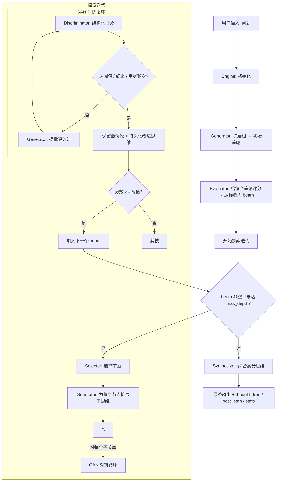

# Dialectica 

[](https://pypi.org/project/dialectica/) [](https://twitter.com/FradSer) [](https://www.python.org/downloads/) [](https://google.github.io/adk-docs/) []()

[English](README.md) | 简体中文

**Dialectica（辩证）** 是一个可插拔的对抗式推理引擎。它在「思维树」上搜索：每个思维经过生成、对抗评估与迭代改进，再综合成答案——*正题 → 反题 → 合题*（Generator → Discriminator → Synthesizer）。设计参考了 [karpathy/autoresearch](https://github.com/karpathy/autoresearch) 的「提议→评估→保留最优」循环与 Claude Code 的可组合 workflows；每个阶段都是可替换组件，默认装配为思维树 + GAN 风格对抗评估循环，基于 Google ADK 2.1。

## 安装

作为库在你自己的项目里使用：

```bash
uv add dialectica
# 或: pip install dialectica
```

```python
import os, asyncio
from dialectica import create_engine

os.environ["GOOGLE_API_KEY"] = "..."          # 由应用方负责环境配置

async def main():
    result = await create_engine("你的问题").run()
    print(result["final_answer"])

asyncio.run(main())
```

库从 `os.environ` 读取配置，**不会**自己加载 `.env`。如果是想开发 Dialectica 本身，见 [本地开发](#本地开发)。

## 核心特性

### 🧩 可插拔引擎（正题 → 反题 → 合题）
`Engine` 只负责搜索的**控制流**，每个决策都委托给注入的组件——任何阶段都可替换而不动引擎：

| 阶段 | 职责 | 默认实现 |
|------|------|----------|
| `Generator` | 提出思维（**正题**） | `LlmGenerator` |
| `Evaluator` | 批评并改进（**反题**） | `AdversarialEvaluator` |
| `Selector` | 选择搜索前沿 | `BeamSearch` |
| `Synthesizer` | 综合成答案（**合题**） | `LlmSynthesizer` |

只需改生成器的提示词或替换某个阶段，就能把它重定向到代码审查、研究、决策等任务——见 [可插拔架构](#可插拔架构)。

### 🔄 GAN 风格对抗评估（保留最优）
每个思维经历**迭代对抗优化**，而非单次评估：
1. **Discriminator** 用结构化 verdict 打分（分数、缺陷、建议）
2. **Generator** 据此改写
3. **Discriminator** 重新打分
4. 循环直到达到阈值、收到终止信号，或用尽 `max_gan_rounds`

改进**不假设单调**——循环保留**分数最高的那一轮**（类似 autoresearch 的「只保留超越当前最优的改动」），并把那一版改进文本存到节点上，让综合用的是改进版而非原版。

### 🌳 择优 beam 的树搜索
- **策略先评分再入 beam**——前沿反映优劣，而非生成顺序
- **束搜索**保留 top-k 最有希望的路径（`BeamSearch`，或 `GreedySearch`）
- **剪枝**：低于阈值的路径丢弃；beam 清空即停止探索
- **多节点综合**：最终答案整合跨分支的高分思维

### 📊 结构化评估结果
`Discriminator` 通过 ADK `output_schema` 返回 `DiscriminatorVerdict`（无脆弱文本解析）。引擎将其包装为 `EvaluationResult`：`score`、`flaws`、`suggestions`、`should_terminate`、`reasoning`、`adversarial_rounds`、`refined_thought`，以及完整的每轮 `history`。

## 工作流

`Engine` 管理三个阶段的工作流：

### 阶段 1：初始化
- 从用户问题创建根节点
- `Generator.expand(root)` 生成初始策略（用 `ThoughtData` 验证）
- **每个策略都经过对抗评分**，达标者进入 beam（若全不达标，回退取 Selector 的 top-k）

### 阶段 2：探索（束搜索）
迭代最多 `max_depth` 次：
1. **选择**：`Selector.select(...)` 从活跃束选出前沿
2. **生成**：`Generator.expand(parent)` 产生子思维
3. **评估**：`Evaluator.evaluate(...)` 跑 GAN 循环，保留最优轮次并持久化改进后的思维
4. **过滤**：分数 ≥ `score_threshold` 的子节点组成下一个 beam

beam 清空或达到 `max_depth` 时停止探索。

### 阶段 3：综合
- `Synthesizer.synthesize(...)` 取高分的已评估思维
- 产生连贯、全面的最终答案



> **警告：高 Token 消耗**
> GAN 对抗评估每个思维需要 2-6 次 LLM 调用。典型问题（50-200 个思维）可能需要 200-800 次 LLM 调用。请密切关注您的使用量和相关成本。

## 本地开发

仅当你想开发 Dialectica 本身时需要（只是*使用*它的话见 [安装](#安装)）：

```bash
git clone https://github.com/FradSer/dialectica
cd dialectica
uv sync
cp dialectica/.env.example dialectica/.env   # 填入 GOOGLE_API_KEY 以跑 live e2e 测试
```

然后跑测试 —— 见 [测试](#测试)。

## 配置

### 环境变量

**模型配置：**
```bash
# 所有代理的默认模型
DEFAULT_MODEL_CONFIG=google:gemini-3.5-flash

# 角色特定覆盖（可选）
GENERATOR_MODEL_CONFIG=google:gemini-3.1-pro
DISCRIMINATOR_MODEL_CONFIG=google:gemini-3.1-pro
SYNTHESIZER_MODEL_CONFIG=google:gemini-3.1-pro
```

**支持的提供商：**
- `google:gemini-3.5-flash`（Google AI Studio）
- `openrouter:anthropic/claude-3.5-sonnet`（OpenRouter）
- `openai:gpt-4o`（OpenAI）

**API 凭证：**
```bash
# Google AI Studio
GOOGLE_API_KEY=your-key-here

# 或 Vertex AI
GOOGLE_GENAI_USE_VERTEXAI=true
GOOGLE_CLOUD_PROJECT=your-project
GOOGLE_CLOUD_LOCATION=us-central1

# OpenRouter
OPENROUTER_API_KEY=sk-or-...

# OpenAI
OPENAI_API_KEY=sk-...
OPENAI_API_BASE=https://api.openai.com/v1
```

### 引擎参数

```python
engine = create_engine(
    problem="你的问题陈述",
    max_depth=4,              # 最大树深度
    beam_width=3,             # 每次迭代的活跃路径数
    max_gan_rounds=3,         # 最大对抗优化轮次
    score_threshold=7.0,      # 继续的最低分数
    synthesizer_model=None,   # 可选的模型覆盖
)
```

## 使用示例

### 基本使用

```python
from dialectica import create_engine

# 创建引擎
engine = create_engine(
    "设计一个可持续的城市交通系统"
)

# 运行工作流
result = await engine.run()

# 访问结果
print(result["final_answer"])
print(f"生成了 {len(result['thought_tree'])} 个思维")
print(f"最佳路径: {result['best_path']}")
```

### 查看结果

`run()` 返回答案以及完整的搜索轨迹：

```python
result = await engine.run()
result["final_answer"]   # 综合后的答案
result["best_path"]      # 从根到最高分思维的节点 id
result["thought_tree"]   # 所有节点，含分数与每轮 GAN 历史
result["stats"]          # total_thoughts, max_depth_reached, duration_seconds
```

### 自定义配置

```python
engine = create_engine(
    problem="优化供应链物流",
    max_depth=5,
    beam_width=5,
    max_gan_rounds=4,
    score_threshold=8.0,
    synthesizer_model="google:gemini-3.1-pro",
)
```

## 项目结构

```
dialectica/
├── __init__.py           # 公共 API 导出
├── agent.py              # 组合根：create_engine() 装配默认实现
├── coordinator.py        # 搜索引擎 —— 编排可插拔的各阶段
├── protocols.py          # 阶段接口：Generator/Evaluator/Selector/Synthesizer
├── generation.py         # LlmGenerator（默认 Generator）+ 列表解析
├── gan_evaluator.py      # AdversarialEvaluator / SinglePassEvaluator（Evaluator）
├── selection.py          # BeamSearch / GreedySearch（Selector）
├── synthesis.py          # LlmSynthesizer（默认 Synthesizer）
├── agent_runtime.py      # 唯一的 LLM 调用入口（run_agent）
├── agent_factory.py      # 动态代理创建（角色模板）
├── models.py             # ThoughtData, DiscriminatorVerdict, EvaluationResult
├── llm_config.py         # 模型配置工厂
└── validation.py         # 思维验证工具
tests/
├── conftest.py           # 加载 .env 供 e2e 跳过判断
├── helpers.py            # 确定性的 mock LLM 替身
├── test_models.py        # schema / verdict 单元测试
├── test_generation.py    # 列表解析 + 生成器提示路由
├── test_gan_evaluator.py # GAN 循环 + 单遍评估器（mock LLM）
├── test_coordinator.py   # 引擎控制流（注入 fake 阶段）
├── test_default_pipeline.py  # 默认组合集成（mock LLM）
└── test_e2e_live.py      # 真实 Gemini E2E（标记 `e2e`）
```

## 测试

测试分两层：

- **Mock 测试**（默认）—— 快速、确定、无需 API key。它把 LLM 调用点替换为替身，
  验证真实的编排逻辑：束搜索、GAN 优化循环、剪枝、综合。
- **真实 E2E**（`@pytest.mark.e2e`）—— 用真实 Gemini API 跑完整工作流。默认不选中，
  且在未设置 `GOOGLE_API_KEY`（从 `dialectica/.env` 加载）时自动跳过。

```bash
uv run pytest          # 仅 mock 测试（秒级，无需 key）
uv run pytest -m e2e   # 真实 API E2E（较慢，需要 GOOGLE_API_KEY）
```

## 可插拔架构

`Coordinator` 只负责搜索的**控制流**，每个决策都委托给注入的组件——任何阶段都可以
替换而不动引擎。也就是说，引擎本身是一个通用的推理工作流，ToT + GAN 只是默认装配。

| 接口 | 职责 | 默认实现 | 可选实现 |
|------|------|----------|----------|
| `Generator` | 把节点扩展成候选思维 | `LlmGenerator` | 自定义提示词/agent |
| `Evaluator` | 给思维打分（可选改进） | `AdversarialEvaluator`（GAN 循环） | `SinglePassEvaluator`（廉价） |
| `Selector` | 选择下一轮搜索前沿 | `BeamSearch(width)` | `GreedySearch` |
| `Synthesizer` | 把思维综合成答案 | `LlmSynthesizer` | 自定义 |

`create_engine(...)` 负责装配默认实现。要定制，自己构建组件并直接构造 `Coordinator`：

```python
from dialectica import Coordinator, BeamSearch, SinglePassEvaluator
from dialectica.agent import build_default_components
from dialectica.agent_factory import create_agent
from dialectica.models import DiscriminatorVerdict

# 从默认实现起步，替换其中一个阶段：
generator, _evaluator, _selector, synthesizer = build_default_components()
discriminator = create_agent(
    role="Discriminator", role_name="Discriminator", output_schema=DiscriminatorVerdict
)

engine = Coordinator(
    problem="...",
    generator=generator,
    evaluator=SinglePassEvaluator(discriminator),   # 更便宜：不跑改进循环
    selector=BeamSearch(width=5),                    # 更宽的前沿
    synthesizer=synthesizer,
    max_depth=3,
    score_threshold=7.0,
)
result = await engine.run()
```

接口都是 `typing.Protocol`（结构化类型，无需继承），任何实现了对应方法的对象都行——
比如一个非 LLM 的启发式 `Evaluator`，或一个保持前沿多样性而非纯 top-k 的 `Selector`。

## 关键组件

### Coordinator
按阶段接口编排三阶段工作流：
- 初始化 → 探索 → 综合
- 管理思维树和活跃束
- 把生成、打分、选择、综合委托给注入的组件

### AgentFactory
从角色模板创建代理：
- 标准化系统提示
- 每角色的工具配置
- 每角色的模型配置
- 运行时代理实例化

### AdversarialEvaluator
实现 GAN 风格评估：
- Generator 提出/改进思维
- Discriminator 通过反馈进行批判
- 迭代优化循环
- 结构化评估结果

### ThoughtData 模型
验证思维结构：
- 必需字段（id, parent_id, depth, content）
- 可选评估数据
- GAN 轮次跟踪
- 评估历史

## 性能考虑

**Token 消耗：**
- GAN 评估：每个思维 2-6 次 LLM 调用（取决于轮次）；策略也会评分
- 束搜索：约 beam_width × max_depth 次迭代
- 典型问题：数十到上百个思维，数百次 LLM 调用

**优化策略：**
- 将 `max_gan_rounds` 降到 1-2 加快执行
- 提高 `score_threshold` 剪得更狠；降低则探索更多路径
- 收窄 beam（`beam_width`）或用 `GreedySearch` 减少扇出
- Generator 用轻量模型、Discriminator 用更强模型
- 换成 `SinglePassEvaluator` 完全跳过改进循环

## 故障排除

### 导入错误
```bash
# 确保 Python 3.11+
python --version

# 重新安装依赖
rm -rf .venv
uv sync
```

### ADK 版本不匹配
```bash
# 检查安装的版本
uv pip show google-adk

# 应显示 2.1.0 或更高
```

### API 密钥问题
```bash
# 测试 Google AI Studio
export GOOGLE_API_KEY=your-key
uv run python -c "from dialectica import create_engine; print('OK')"
```

## 贡献

欢迎贡献！感兴趣的领域：
- 新的阶段实现（`Generator` / `Evaluator` / `Selector` / `Synthesizer`）
- 替代的搜索/选择策略（如保持多样性的前沿）
- 性能优化
- 文档改进
- 测试覆盖率

## 许可证

[MIT](LICENSE)

## 参考资料

- [karpathy/autoresearch](https://github.com/karpathy/autoresearch) —— 提议 → 评估 → 保留最优 循环
- [Google ADK 文档](https://google.github.io/adk-docs/)
- [思维树论文](https://arxiv.org/abs/2305.10601)

## 致谢

基于 [Google ADK](https://github.com/google/adk-python) 构建，灵感来自思维树研究、[karpathy/autoresearch](https://github.com/karpathy/autoresearch) 的自主保留最优循环，以及 Claude Code 的可组合 workflows。