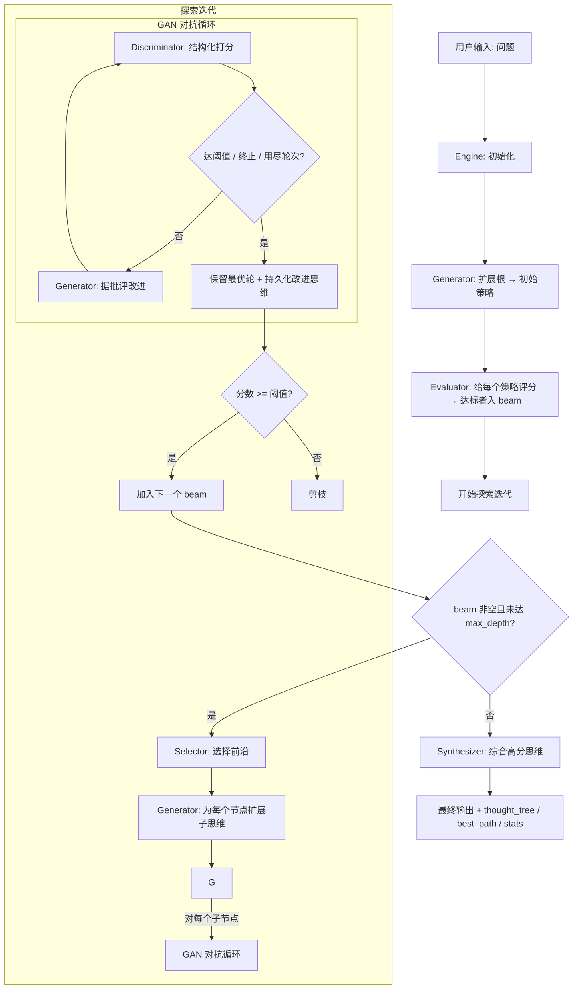

# Dialectica 

[](https://pypi.org/project/dialectica/) [](https://twitter.com/FradSer) [](https://www.python.org/downloads/) [](https://google.github.io/adk-docs/) []()

[English](README.md) | **简体中文**

**Dialectica（辩证）** 是一个基于 Google ADK 的推理引擎工具箱。它是用数据「逼」出来的——把各引擎放在受控基线下实测，只保留数据站得住的部分。诚实的层级：

- **Agentic 引擎**（`create_agentic_engine`）——唯一真正让模型做到「单次调用做不到的事」的引擎：工具使用循环（行动 → 观察 → 迭代）。它靠**增加能力**取胜，而非质量——实测**小模型 8/8 对单次调用 0/8**，在需要通过工具获取信息的任务上。
- **执行制导修复**（`create_repair_engine`）——生成 → 跑验证器 → 据失败修复 → 重试。在可验证任务上，以**几分之一的成本**达到 best-of-N 的可靠性（成功即短路）。
- **辩证引擎**（`create_dialectic_engine`）——*正题 → 反题 → 合题*：一条**可审计**、受 criteria 引导的推理轨迹（透明，而非更好的答案）。
- **思维树 + GAN**（`create_engine`）——上一代可插拔流水线，保留作基线。实测在同成本下被**压制**（输给 best-of-N 与扁平 self-refine——见 [评测](#评测) 第 3 条）；仅作研究与向后兼容保留，不推荐用于质量。

设计参考 [karpathy/autoresearch](https://github.com/karpathy/autoresearch) 与 Claude Code 的可组合 workflows。

> **诚实边界（实测，无预设结论——见 [评测](#评测)）。** 先说硬结论：在**自包含**任务上，*没有*任何纯 LLM scaffold（ToT、辩证）能在结果质量上胜过同 prompt 的单次调用，各模型规模皆然（辩证 **0-3-2** 对同 prompt 基线；ToT+GAN 对单次调用 **0-4-1**，且在同成本下被扁平 best-of-N 与 self-refine **压制**）——它们只是重排模型已有的思考，不注入新信息，而树结构还会*削弱*扁平循环本就提供的精炼。即使在 **Game-of-24**——ToT 的经典搜索基准——该任务对所有云可得模型也已**饱和**（最难那批谜题，单次调用在 qwen-flash / gemini-lite / doubao-lite / glm-5.2 上均为 5/5），ToT 的恢复区间为空。引擎取胜的唯一途径是补上单次前向传播缺失的东西：**对世界采取行动**（agentic：小模型 **8/8 对 0/8**）或**真值验证**（repair：best-of-N 可靠性、**约 1/3 的调用数**）。复现：`uv run python -m evals.agentic_eval` 与 `uv run python -m evals.repair_ablation`。

## 安装

作为库在你自己的项目里使用：

```bash
uv add dialectica
# 或: pip install dialectica
```

```python
import os, asyncio
from dialectica import create_repair_engine

os.environ["GOOGLE_API_KEY"] = "..."          # 由应用方负责环境配置

# 验证器对任意客观检查返回 (passed, feedback)——单元测试、JSON schema、
# linter、断言校验的业务逻辑。引擎据反馈反复修复，直到通过或用尽次数。
def verify(answer: str) -> tuple[bool, str]:
    ok = "def solve" in answer                 # 换成你真正的检查
    return ok, "" if ok else "未定义 solve() 函数"

async def main():
    result = await create_repair_engine(
        "写一个 solve() 函数……", verifier=verify
    ).run()
    print(result["passed"], result["attempts"], result["final_answer"])

asyncio.run(main())
```

需要多步、用工具的任务，用 `create_agentic_engine`（注入工具，引擎驱动「行动→观察→迭代」循环）；可验证任务用 `create_repair_engine`；需要可审计推理轨迹的开放式问题用 `create_dialectic_engine`；旧版 `create_engine`（思维树 + GAN）保留作基线。库从 `os.environ` 读取配置，**不会**自己加载 `.env`。如果是想开发 Dialectica 本身，见 [本地开发](#本地开发)。

## 核心特性

### 🤖 Agentic 引擎——增加能力（`create_agentic_engine`）
唯一让模型做到「单次前向传播做不到的事」的引擎：工具使用循环。注入你的工具（读文件、跑测试、查服务），智能体规划、调用工具、读取结果、迭代，直到任务客观完成——由 ADK 驱动循环。

- **靠能力取胜，而非质量**——实测**小模型 8/8 对单次调用 0/8**，在需要通过工具获取信息的任务上（`evals/agentic_eval.py`）。这是真正的价值类别；自包含 prompt 上的推理 scaffold 只能与单次调用打平（见 [评测](#评测)）。
- **任务无关**——工具是注入的可调用对象，ADK 自动推导其 schema，引擎保持通用。
- **返回** `{final_answer}`；副作用通过你的工具发生，故事后由你检查客观结果。

### 🛠️ 执行制导修复——验证器在环（`create_repair_engine`）
面向可验证任务：**生成 → 跑注入的验证器 → 据具体失败修复 → 重试**，直到通过或用尽次数。它在**质量**上打不过同成本的重采样，但以低得多的成本达到同等可靠性。

- **任务无关的验证器**——任意 `Callable[[answer], (passed, feedback)]`：单元测试、schema 校验、linter、断言校验的逻辑。`solution_format` 固定验证器解析的输出形态。
- **用完整失败历史**——每次先前尝试及其确切失败都回喂，避免在两个错误解之间反复横跳。
- **成本自律**——验证器一通过即短路，以几分之一的调用数达到 best-of-N 的可靠性（如同等通过率下 20 对 60 次调用）。
- **返回** `{final_answer, passed, attempts, history}`。

### 🔗 Workflow 原语——可组合的多 agent 运行时（`Workflow`）
Claude Code `Workflow` 工具的 Python 复刻，建立在仓库唯一的 LLM 调用接缝上。用普通 async Python 表达任意多 agent 工作流——原语包括 `agent()`（一次 LLM 调用，可选 Pydantic schema）、`parallel()`（屏障）、`pipeline()`（无屏障逐项过 stage）、`phase()`、`log()`，以及一个调用 `Budget`。

```python
from dialectica import Workflow, agent, parallel, phase
from pydantic import BaseModel

class Verdict(BaseModel):
    summary: str
    confidence: str

async def research(question: str):
    phase("Gather")
    findings = await parallel(
        lambda: agent(f"广角研究: {question}"),
        lambda: agent(f"质疑式研究: {question}"),
    )
    phase("Synthesize")
    return await agent(
        f"综合: {' | '.join(f for f in findings if f)}",
        schema=Verdict,
    )

result = await Workflow(lambda: research("...")).run()
```

**诚实边界。** 这是一个面向**元任务**的**编排层**——研究、审查、规划、设计：这类任务没有 ground truth，扇出 / 对抗审判 / 综合的形状确实有用。它**不是**自包含结果质量引擎：在开放式咨询任务上，盲评判官测得 **0-4-1 / 0-2-3 / 0-1-4**（对 单次 / best-of-N / self-refine，见 `evals/quality_ablation.py`）。但在**多利益相关者对抗任务**——即单次前向传播只能站一个立场、把冲突糊弄过去的 regime——工作流引擎实测**净 +1**（盲评，同成本；`evals/workflow_ablation.py` + `evals/meta_problems.py`）。关键杠杆是 synthesis 的锐度：「承诺一个绑定决策，而非把所有选项都列举一遍」——增加更多结构（kill-condition、编号 critique 逐条回应）反而一致地**降低**分数。根据任务选对工具：多视角审查用 `pipeline(items, find, adversarially_verify, synthesize)`；可验证任务用 `repair.py`；用工具的任务用 `agentic.py`。

### 🧩 可插拔引擎（正题 → 反题 → 合题）
`Engine` 只负责搜索的**控制流**，每个决策都委托给注入的组件——任何阶段都可替换而不动引擎：

| 阶段 | 职责 | 默认实现 |
|------|------|----------|
| `Generator` | 提出思维（**正题**） | `LlmGenerator` |
| `Evaluator` | 批评并改进（**反题**） | `AdversarialEvaluator` |
| `Selector` | 选择搜索前沿 | `BeamSearch` |
| `Synthesizer` | 综合成答案（**合题**） | `LlmSynthesizer` |

只需改生成器的提示词或替换某个阶段，就能把它重定向到代码审查、研究、决策等任务——见 [可插拔架构](#可插拔架构)。

### 🔄 GAN 风格对抗评估（保留最优）
每个思维经历**迭代对抗优化**，而非单次评估：
1. **Discriminator** 用结构化 verdict 打分（分数、缺陷、建议）
2. **Generator** 据此改写
3. **Discriminator** 重新打分
4. 循环直到达到阈值、收到终止信号，或用尽 `max_gan_rounds`

改进**不假设单调**——循环保留**分数最高的那一轮**（类似 autoresearch 的「只保留超越当前最优的改动」），并把那一版改进文本存到节点上，让综合用的是改进版而非原版。

### 🌳 择优 beam 的树搜索
- **策略先评分再入 beam**——前沿反映优劣，而非生成顺序
- **束搜索**保留 top-k 最有希望的路径（`BeamSearch`，或 `GreedySearch`）
- **剪枝**：低于阈值的路径丢弃；beam 清空即停止探索
- **多节点综合**：最终答案整合跨分支的高分思维

### 📊 结构化评估结果
`Discriminator` 通过 ADK `output_schema` 返回 `DiscriminatorVerdict`（无脆弱文本解析）。引擎将其包装为 `EvaluationResult`：`score`、`flaws`、`suggestions`、`should_terminate`、`reasoning`、`adversarial_rounds`、`refined_thought`，以及完整的每轮 `history`。

## 工作流

`Engine` 管理三个阶段的工作流：

### 阶段 1：初始化
- 从用户问题创建根节点
- `Generator.expand(root)` 生成初始策略（用 `ThoughtData` 验证）
- **每个策略都经过对抗评分**，达标者进入 beam（若全不达标，回退取 Selector 的 top-k）

### 阶段 2：探索（束搜索）
迭代最多 `max_depth` 次：
1. **选择**：`Selector.select(...)` 从活跃束选出前沿
2. **生成**：`Generator.expand(parent)` 产生子思维
3. **评估**：`Evaluator.evaluate(...)` 跑 GAN 循环，保留最优轮次并持久化改进后的思维
4. **过滤**：分数 ≥ `score_threshold` 的子节点组成下一个 beam

beam 清空或达到 `max_depth` 时停止探索。

### 阶段 3：综合
- `Synthesizer.synthesize(...)` 取高分的已评估思维
- 产生连贯、全面的最终答案



> **警告：高 Token 消耗**
> GAN 对抗评估每个思维需要 2-6 次 LLM 调用。典型问题（50-200 个思维）可能需要 200-800 次 LLM 调用。请密切关注您的使用量和相关成本。

## 与思维树论文的对应关系

默认装配与 [Yao et al. 2023](https://arxiv.org/abs/2305.10601) 框架的映射：

| ToT 论文概念 | Dialectica |
|--------------|------------|
| 思维分解（thought decomposition） | 通用两级提示词：根 → 策略、节点 → 下一步（`generation.py` 模板）——非论文中的按任务定制 |
| 思维生成器 `G(p, s, k)` —— **propose** | `LlmGenerator`：单次调用提出 k 个不同候选（受 `max_items` 上限约束） |
| 思维生成器 —— **sample**（k 次独立 CoT 采样） | 未内置；可通过自定义 `Generator` 插入 |
| 状态评估器 `V(p, S)` —— **value**（独立标量打分） | Discriminator 的 0-10 结构化裁决 |
| 状态评估器 —— **vote**（比较式投票） | 未内置；可通过自定义 `Evaluator`/`Selector` 插入 |
| ToT-BFS（广度上限 `b`） | `BeamSearch(width=b)`；`GreedySearch` 即 `b=1` |
| DFS 剪枝阈值 `v_th` | `score_threshold`（低于阈值的子节点被剪掉） |
| DFS + **回溯**（backtracking） | 未实现——beam 清空即停止探索，不会回访父节点 |
| 评估器 **lookahead** 前瞻模拟 | 未实现（提示词层面的缺口） |

超出论文的刻意扩展：评估器会*改写*思维（GAN 保留最优循环——论文的评估器
从不修改状态）；最终由 `Synthesizer` 跨分支整合高分思维（论文输出最佳路径）。

## 本地开发

仅当你想开发 Dialectica 本身时需要（只是*使用*它的话见 [安装](#安装)）：

```bash
git clone https://github.com/FradSer/dialectica
cd dialectica
uv sync
cp .env.example dialectica/.env   # 填入 GOOGLE_API_KEY 以跑 live e2e 测试
```

然后跑测试 —— 见 [测试](#测试)。

## 配置

### 环境变量

**模型配置：**
```bash
# 所有代理的默认模型
DEFAULT_MODEL_CONFIG=google:gemini-3.5-flash

# 角色特定覆盖（可选）
GENERATOR_MODEL_CONFIG=google:gemini-3.1-pro-preview
DISCRIMINATOR_MODEL_CONFIG=google:gemini-3.1-pro-preview
SYNTHESIZER_MODEL_CONFIG=google:gemini-3.1-pro-preview
```

**支持的提供商：**
- `google:gemini-3.5-flash`（Google AI Studio）
- `openrouter:anthropic/claude-3.5-sonnet`（OpenRouter）
- `openai:gpt-4o`（OpenAI）

**API 凭证：**
```bash
# Google AI Studio
GOOGLE_API_KEY=your-key-here

# 或 Vertex AI
GOOGLE_GENAI_USE_VERTEXAI=true
GOOGLE_CLOUD_PROJECT=your-project
GOOGLE_CLOUD_LOCATION=us-central1

# OpenRouter
OPENROUTER_API_KEY=sk-or-...

# OpenAI
OPENAI_API_KEY=sk-...
OPENAI_API_BASE=https://api.openai.com/v1
```

### 引擎参数

```python
engine = create_engine(
    problem="你的问题陈述",
    max_depth=4,               # 最大树深度
    beam_width=3,              # 每次迭代的活跃路径数
    max_gan_rounds=3,          # 最大对抗优化轮次
    score_threshold=7.0,       # 入 beam 的最低分数
    gan_score_threshold=None,  # GAN「足够好，停止精炼」线（默认同 score_threshold）
    criteria=None,             # Discriminator 评分标准（默认可行性导向）
    synthesizer_model=None,    # 可选的模型覆盖
)
```

`criteria` 值得特别注意：早期评测矩阵证明 Discriminator 的评分标准会引导答案的
**内容**而不只是筛选（见[评测](#评测)）。默认标准以可行性为锚；
传入自定义标准即可重定向引擎（例如安全审查标准）。

兄弟思维会**并发**展开与评估；运行时对瞬时 LLM 失败做指数退避重试——
单次网络错误不再毁掉整个长跑。

## 使用示例

### 基本使用

```python
from dialectica import create_engine

# 创建引擎
engine = create_engine(
    "设计一个可持续的城市交通系统"
)

# 运行工作流
result = await engine.run()

# 访问结果
print(result["final_answer"])
print(f"生成了 {len(result['thought_tree'])} 个思维")
print(f"最佳路径: {result['best_path']}")
```

### 查看结果

`run()` 返回答案以及完整的搜索轨迹：

```python
result = await engine.run()
result["final_answer"]   # 综合后的答案
result["best_path"]      # 从根到最高分思维的节点 id
result["thought_tree"]   # 所有节点，含分数与每轮 GAN 历史
result["stats"]          # total_thoughts, max_depth_reached, duration_seconds
```

### 自定义配置

```python
engine = create_engine(
    problem="优化供应链物流",
    max_depth=5,
    beam_width=5,
    max_gan_rounds=4,
    score_threshold=8.0,
    synthesizer_model="google:gemini-3.1-pro-preview",
)
```

## 项目结构

```
dialectica/
├── __init__.py           # 公共 API 导出
├── agent.py              # 组合根：create_engine() 装配默认实现
├── agent_factory.py      # 从角色模板动态创建 ADK Agent
├── agent_runtime.py      # 唯一的 LLM 调用入口（run_agent），含重试与并发控制
├── agentic.py            # AgenticEngine —— 工具使用 ADK 循环
├── coordinator.py        # ToT 束搜索引擎（初始化 → 探索 → 综合）
├── dialectic.py          # DialecticEngine —— 正题/反题/合题螺旋
├── gan_evaluator.py      # AdversarialEvaluator（GAN 循环）/ SinglePassEvaluator
├── generation.py         # LlmGenerator + 列表解析
├── llm_config.py         # 模型配置工厂（解析 provider:model_name）
├── models.py             # ThoughtData, DiscriminatorVerdict, EvaluationResult
├── protocols.py          # 阶段接口：Generator/Evaluator/Selector/Synthesizer
├── repair.py             # IterativeRepairEngine —— 生成/验证/修复循环
├── selection.py          # BeamSearch / GreedySearch
├── synthesis.py          # LlmSynthesizer
├── validation.py         # 思维验证工具
└── workflow.py           # Workflow + agent/parallel/pipeline/phase/log 原语
tests/                       # 22 个测试文件，12 个 BDD feature 文件
├── conftest.py              # 加载 .env 供 e2e 跳过判断
├── helpers.py               # 确定性的 mock LLM 替身
├── features/                # Gherkin 场景（pytest-bdd）
│   ├── adversarial_evaluation.feature
│   ├── agentic.feature
│   ├── code_eval.feature
│   ├── dialectic.feature
│   ├── engine.feature
│   ├── eval_harness.feature
│   ├── game24.feature
│   ├── lcb_eval.feature
│   ├── quality_ablation.feature
│   ├── repair.feature
│   ├── resilience.feature
│   └── workflow.feature
└── test_*.py                # 步骤定义与单元测试
evals/                       # 评测工具（开发工具，不随包发布）
├── __main__.py              # CLI：uv run python -m evals
├── harness.py               # 编排、调用计数、报告渲染
├── judge.py                 # 盲评裁判（换位双评消除位置偏差）
├── baseline.py              # 单次调用基线（对照组）
├── problems.py              # 基准问题集（DEFAULT_PROBLEMS）
├── hard_problems.py         # Game-of-24 最难的题（需要分数运算）
├── hard_solutions.py        # hard_problems 的已验证解
├── novel_problems.py        # 未污染的边界情况代码题
├── novel_solutions.py       # novel_problems 的已验证解
├── code_problems.py         # HumanEval 风格的 SWE 问题（ground truth）
├── agentic_eval.py          # Agentic 引擎评测（隐藏预言机）
├── repair_ablation.py       # Repair 引擎消融实验
├── quality_ablation.py      # ToT vs 单次 vs best-of-N vs self-refine
├── game24.py                # Game-of-24 基准
├── game24_princeton.py      # Princeton Game-of-24 数据集
├── code_eval.py             # 代码评测工具
├── lcb.py                   # LiveCodeBench 评测
├── meta_problems.py         # 多利益相关者元问题集
└── workflow_ablation.py     # Workflow 引擎消融实验
```

## 测试

测试分两层：

- **Mock 测试**（默认）—— 快速、确定、无需 API key。它把 LLM 调用点替换为替身，
  验证真实的编排逻辑：束搜索、GAN 优化循环、剪枝、综合。
- **真实 E2E**（`@pytest.mark.e2e`）—— 用真实 Gemini API 跑完整工作流。默认不选中，
  且在未设置 `GOOGLE_API_KEY`（从 `dialectica/.env` 加载）时自动跳过。

```bash
uv run pytest          # 仅 mock 测试（秒级，无需 key）
uv run pytest -m e2e   # 真实 API E2E（较慢，需要 GOOGLE_API_KEY）
```

## 评测

> **核心发现（2026-06-17，实测，无预设结论）。** 以下结论取代下文更早的 advice 矩阵（2026-06-10/11），那批实验用的是更弱的基线。
>
> 1. **引擎真正取胜之处——能力，而非质量。** 在需要*行动*的任务上（agentic 隐藏函数发现基准），小模型 + **agentic 引擎**得 **8/8**，单次调用 **0/8**：它探测隐藏函数、推断规则、再实现——单次调用没探测就无从知道任意规则。这是真正的价值类别。复现：`uv run python -m evals.agentic_eval`。
> 2. **scaffold 不取胜之处——自包含任务的结果质量。** 对*同成本*基线，**没有任何纯 LLM scaffold 能胜过单次调用**：辩证对同 prompt 强基线在各模型规模上都是 **0-3-2**（早先的 4-1-0「胜」是 prompt + 长度，不是结构）。**repair** 胜过*单次*调用，但与同成本 best-of-K **恰好打平**（在 HumanEval、自建边界题集、LeetCode-medium、LCB-hard、专门构造的未污染基准上皆然——连最小的模型都一次做对，「会失败但可修」的区间几乎为空）。repair 的真实优势是**成本**（best-of-N 的可靠性、约 1/3 的调用数）。复现：`uv run python -m evals.repair_ablation`。
> 3. **树结构是被*压制*的，而非仅仅无用（2026-06-22）。** 两项测试补上最后的疑点。在 **Game-of-24**——ToT *自己的*经典可验证搜索基准——上，*忠实*的 ToT（部分状态节点、前瞻价值、BFS、胜出叶即答案）得 **14/15，以约 34× 成本输给单次调用的 15/15**：现代模型对 2023 年论文里 GPT-4 96% 失败的任务一次做对（ToT 主场上的天花板）。而此前缺失的对照——**best-of-N + selector** 与 **K 轮 self-refine**——在同成本盲评下：ToT+GAN 引擎为 **0-4-1 / 0-2-3 / 0-1-4**（对 单次 / best-of-N / self-refine）——它**从未赢下一场**。质量排序为 **self-refine ≥ best-of-N ≥ 单次 ≥ 树式 scaffold**：对抗/精炼*机制*有用（扁平 self-refine 是最佳方法），但*树/beam/对抗最佳路径结构*反而削弱了它。复现：`uv run python -m evals.game24` 与 `uv run python -m evals.quality_ablation`。
> 4. **ToT 的价值窗口在*整个*可用模型范围上已关闭（2026-06-22）。** ToT 只在「基模型单独失败、但搜索能恢复」的「会失败但可修」区间内有用。把*最难*的 Game-of-24 谜题（需分数的经典：`3 3 8 8`、`1 5 5 5`、`3 3 7 7`、`1 3 4 6`、`4 4 7 7`）拿到**四个模型层级**——`qwen3.6-flash`、`gemini-3.1-flash-lite`、`doubao-seed-2-0-lite`、`glm-5.2`（最弱的云可得模型）——上测，单次调用**每个模型、每道题都是 5/5**。没有任何可达的弱模型会失败，因此 ToT 的搜索没有可恢复的差距。同样的饱和也出现在 repair 的可验证基准上，这里也一样：Game-of-24 对任何你调得到的模型都不再是「需要搜索」的基准。ToT「抬高边界质量」的论点在理论上成立，但边界已经越过了这个任务。

引擎真的比单次强模型调用更好吗？仓库自带评测工具（`evals/`，开发工具，
不随包发布）用数据回答这个问题：每道基准题分别由**引擎**和**单次调用基线**
求解，再由**盲评裁判**换位评判两次（两次裁决不一致即判平局，消除位置偏差），
并统计两边的 LLM 调用数和耗时。

```bash
uv run python -m evals                          # 全部基准题
uv run python -m evals --limit 2 --json out.json
```

模型可用环境变量覆盖：`BASELINE_MODEL_CONFIG` / `JUDGE_MODEL_CONFIG`。

### 早期 advice 矩阵（2026-06-10/11）——已被取代

> **已被上文核心发现取代。** 这批矩阵把引擎对比的是**单个答案**的基线（由 `gemini-3.5-flash` 盲评）——**不是**同成本下的**同 prompt** 基线。当基线后来被给到同样的质量门槛（核心发现 #2，2026-06-17），下面这些表面胜绩（如 20-8-2）便坍缩为 **0-3-2**。请把这里的数字读作「引擎 vs 朴素 prompt 的单个答案」——它有价值，是关于 Discriminator **评分标准如何引导内容**的研究，而**不是**引擎胜过公平基线的证据。

5 道基准题 × 三轮完整矩阵（裁判统一为 `gemini-3.5-flash` 盲评换位双评；引擎配置
`max_depth=2, beam_width=2, max_gan_rounds=2`）。V1 与 V2 之间只改了一处：
Discriminator 评分标准中的 **"Innovation"（创新性）** 替换为 **"Feasibility
under stated constraints"（给定约束下的可行性）**——矩阵因此构成一次对照实验，
检验对抗评分标准如何引导答案。V3 是 V2 标准的第二个 seed，在引擎加入并发评估
与裁决重试之后运行。

| 矩阵 | 评分标准 | 引擎(flash) vs flash | 引擎(flash) vs **pro** | 引擎(qwen) vs qwen | 合计（胜-负-平） |
|------|----------|------|------|------|------|
| V1 | Innovation | 2-1-2 | 3-2-0 | 2-2-1 | 7-5-3 |
| V2 | Feasibility | 4-1-0 | 4-1-0 | 3-2-0 | **11-4-0** |
| V3 | Feasibility（seed 2） | 2-2-1 | 3-2-0 | **4-0-1** | 9-4-2 |

V1 → V2 对照实验的逐题明细：

| 问题 | 引擎(flash) vs flash | 引擎(flash) vs **pro** | 引擎(qwen) vs qwen |
|------|------|------|------|
| cloud-costs | 平 → 引擎 | 引擎 → 引擎 | 引擎 → 基线 |
| api-versioning | 引擎 → 引擎 | 引擎 → 引擎 | 基线 → 引擎 |
| flaky-tests | 引擎 → 引擎 | 引擎 → 引擎 | 引擎 → 引擎 |
| meeting-overload | 平 → 基线 | 基线 → 引擎 | 基线 → 基线 |
| urban-transport | 基线 → 引擎 | 基线 → 基线 | 平 → 引擎 |

pro = 单次 `gemini-3.1-pro-preview` 调用；qwen = `qwen3.6-35b-a3b`。
引擎成本约为基线的 20 倍调用（Gemini）/ 30 倍（Qwen）。

45 场对比的结论：

- **评分标准是方向盘，不只是过滤器**：换掉一条标准就把战绩从 V1 的 7-5-3
  推到可行性标准两 seed 合并的 **20-8-2**。因为 GAN 循环会按批评*改写*思维
  （不同于纯价值函数），Discriminator 奖励什么，最终答案就长成什么样。
- **技术/工程类问题引擎稳赢**：V1 为 7-1-1，可行性标准下合并 **15-2-1**
  （云成本、API 版本化、flaky 测试治理）。裁判反复肯定对抗精炼磨出的细节深度
  （契约测试管线、brownout 的 HTTP 语义、锁定财务承诺前的稳定观察期与回滚预案）。
- **组织/社会类问题从稳输升到大致平手**：V1 为 0-4-2（败因一致为"过度复杂、
  不切实际"，跨模型家族复现），可行性标准下合并 5-6-1——仍是短板，
  且单 seed 方差明显。
- flash 引擎对单次更强的 pro 调用合并净胜 **7-3**：搜索能买回模型档位差，
  代价约 20 倍调用。
- **并发化把引擎墙钟时间砍掉 2-3 倍**（调用数不变）：Gemini 上 V3 为 64-108
  秒/题（V2 串行时 143-228 秒），Qwen 上 272-314 秒（串行时 533-915 秒）。
  Qwen 后端约 7-10% 的裁决瞬时为空，裁决重试在 V3 中全部治愈（5/5）——
  串行时代这些曾被静默扣 0 分。

注意：flash 裁判、样本量小——结论是方向性的，非定论（V2 与 V3 的总分差
表明单 seed 噪声约 ±2 场）。完整报告（含全部答案与裁决理由）运行后生成于
`evals/results/`。

### SWE 套件结果（2026-06-12，地面真值）

`swe` 套件（12 道 HumanEval 式题目，跑单元测试判定通过/失败——无裁判）在
三个本地 ollama 模型上运行。全量模式（引擎跑每道题，基线单次尝试）显示
引擎略占优势：

| 模型 | 引擎 | 基线（1 次尝试） |
|------|------|------------------|
| gpt-oss:20b | 11/12 | 10/12 |
| gemma4:e4b-mlx | 10/12 | 9/12 |

救援模式随后拆穿了这个优势。先用 **2 次尝试**的基线筛题，引擎只跑真正的
失败题：

| 模型 | 基线解决（pass@2） | 待救援 | 救回 |
|------|---------------------|--------|------|
| gpt-oss:20b | 12/12 | 0 | — |
| gemma4:26b-mlx | 12/12 | 0 | — |
| gemma4:e4b-mlx | 11/12 | 1（max-fill） | **0** |

诚实的解读：在这个难度的题目上，引擎对单次调用的表面优势主要是**重采样
运气**——引擎约 15 次调用隐含了多次"尝试"，而基线只要简单地问两次（2 次
调用）就能追平。唯一真实的能力缺口（4B 级模型上的 max-fill）经 11 次引擎
调用仍未救回。全量模式还观察到引擎把基线本来能过的题做砸（e4b 的
min-path）——综合阶段可能损坏正确代码，这正是救援模式（结构上不碰基线
已解题目）成为默认的原因。

结论：对可验证任务，给任何脚手架记功之前，先和**同等成本的 pass@k**
对比。上文 advice 套件面临同一批评的高阶版本（其基线是单个答案而非
best-of-k）——best-of-2 加裁判的基线是下一个要跑的对照。

随后套件扩展到 18 题，加入文献点名的 HumanEval 最难题（`find_zero`、
`order_by_points`、`match_parens`、`decode_cyclic` 等），并通过 AI Studio
API 对云端 gemma-4 跑救援模式：**`gemma-4-31b-it` 和 `gemma-4-26b-a4b-it`
均在 pass@2 内解决 18/18**——失败集为空，连本地 4B 级的 `gemma4:e4b` 也能
17/18。HumanEval 级题目对该模型家族已饱和；要在代码任务上证明引擎的真实
价值，需要 LiveCodeBench/竞赛级难度。（附带发现：强制 JSON mode 会令
`gemma-4-26b-a4b-it` 返回空/截断裁决，因此提供了 `structured_output=False`
回退到提示词驱动 JSON。）

## 可插拔架构

`Coordinator` 只负责搜索的**控制流**，每个决策都委托给注入的组件——任何阶段都可以
替换而不动引擎。也就是说，引擎本身是一个通用的推理工作流，ToT + GAN 只是默认装配。

| 接口 | 职责 | 默认实现 | 可选实现 |
|------|------|----------|----------|
| `Generator` | 把节点扩展成候选思维 | `LlmGenerator` | 自定义提示词/agent |
| `Evaluator` | 给思维打分（可选改进） | `AdversarialEvaluator`（GAN 循环） | `SinglePassEvaluator`（廉价） |
| `Selector` | 选择下一轮搜索前沿 | `BeamSearch(width)` | `GreedySearch` |
| `Synthesizer` | 把思维综合成答案 | `LlmSynthesizer` | 自定义 |

`create_engine(...)` 负责装配默认实现。要定制，自己构建组件并直接构造 `Coordinator`：

```python
from dialectica import Coordinator, BeamSearch, SinglePassEvaluator
from dialectica.agent import build_default_components
from dialectica.agent_factory import create_agent
from dialectica.models import DiscriminatorVerdict

# 从默认实现起步，替换其中一个阶段：
generator, _evaluator, _selector, synthesizer = build_default_components()
discriminator = create_agent(
    role="Discriminator", role_name="Discriminator", output_schema=DiscriminatorVerdict
)

engine = Coordinator(
    problem="...",
    generator=generator,
    evaluator=SinglePassEvaluator(discriminator),   # 更便宜：不跑改进循环
    selector=BeamSearch(width=5),                    # 更宽的前沿
    synthesizer=synthesizer,
    max_depth=3,
    score_threshold=7.0,
)
result = await engine.run()
```

接口都是 `typing.Protocol`（结构化类型，无需继承），任何实现了对应方法的对象都行——
比如一个非 LLM 的启发式 `Evaluator`，或一个保持前沿多样性而非纯 top-k 的 `Selector`。

## 关键组件

### Coordinator
按阶段接口编排三阶段工作流：
- 初始化 → 探索 → 综合
- 管理思维树和活跃束
- 把生成、打分、选择、综合委托给注入的组件

### AgentFactory
从角色模板创建代理：
- 标准化系统提示
- 每角色的工具配置
- 每角色的模型配置
- 运行时代理实例化

### AdversarialEvaluator
实现 GAN 风格评估：
- Generator 提出/改进思维
- Discriminator 通过反馈进行批判
- 迭代优化循环
- 结构化评估结果

### ThoughtData 模型
验证思维结构：
- 必需字段（id, parent_id, depth, content）
- 可选评估数据
- GAN 轮次跟踪
- 评估历史

## 性能考虑

**Token 消耗：**
- GAN 评估：每个思维 2-6 次 LLM 调用（取决于轮次）；策略也会评分
- 束搜索：约 beam_width × max_depth 次迭代
- 典型问题：数十到上百个思维，数百次 LLM 调用

**优化策略：**
- 将 `max_gan_rounds` 降到 1-2 加快执行
- 提高 `score_threshold` 剪得更狠；降低则探索更多路径
- 收窄 beam（`beam_width`）或用 `GreedySearch` 减少扇出
- Generator 用轻量模型、Discriminator 用更强模型
- 换成 `SinglePassEvaluator` 完全跳过改进循环

## 故障排除

### 导入错误
```bash
# 确保 Python 3.11+
python --version

# 重新安装依赖
rm -rf .venv
uv sync
```

### ADK 版本不匹配
```bash
# 检查安装的版本
uv pip show google-adk

# 应显示 2.1.0 或更高
```

### API 密钥问题
```bash
# 测试 Google AI Studio
export GOOGLE_API_KEY=your-key
uv run python -c "from dialectica import create_engine; print('OK')"
```

## 贡献

欢迎贡献！感兴趣的领域：
- 新的阶段实现（`Generator` / `Evaluator` / `Selector` / `Synthesizer`）
- 替代的搜索/选择策略（如保持多样性的前沿）
- 性能优化
- 文档改进
- 测试覆盖率

## 许可证

[MIT](LICENSE)

## 参考资料

- [karpathy/autoresearch](https://github.com/karpathy/autoresearch) —— 提议 → 评估 → 保留最优 循环
- [Google ADK 文档](https://google.github.io/adk-docs/)
- [思维树论文](https://arxiv.org/abs/2305.10601)

## 致谢

基于 [Google ADK](https://github.com/google/adk-python) 构建，灵感来自思维树研究、[karpathy/autoresearch](https://github.com/karpathy/autoresearch) 的自主保留最优循环，以及 Claude Code 的可组合 workflows。